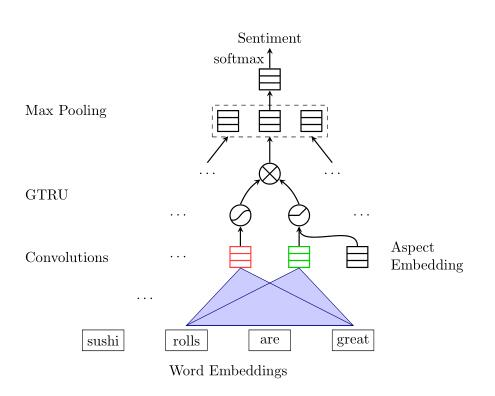

# AI Challenger 2018 细粒度用户评论情感分析
17th 解决方案，A榜 f1=0.71564，B榜 f1=0.71444，基于Aspect Level的思路，使用了两个模型。

## 运行

代码运行的TensorFlow版本为1.4.1，将比赛的用到的

* ai_challenger_fsauor2018_testa_20180816.zip
* ai_challenger_fsauor2018_validationset_20180816.zip
* ai_challenger_fsauor2018_trainingset_20180816.zip

这三个数据集放至 data/ 目录下，在根目录下运行以下命令即可：

`sh run.sh`

## 结构
* word2vec.py: 词向量、字向量生成
* feature.py: 生成SVD特征
* GCAE_word_char.py: 模型代码
* SynAtt_expand_model.py: 模型代码
* train.py: 训练入口
* utils.py: 一些公用的函数

## 模型结构
### 字词向量联合表示
借鉴R-NET（R-NET:MACHINE READING COMPREHENSION WITH SELF-MATCHING NETWORKS）的方法，采用词向量和字向量联合表示。

```
例如：奶茶十分好喝

词向量表示：[W2V(奶茶),W2V(十分), W2V(好喝)]

经过BiRNN的字向量：[BiRNN(奶,茶),BiRNN(十,分), BiRNN (好,喝)]

最终向量表示：[Concat(W2V(奶茶), BiRNN(奶,茶)), Concat(W2V(十分), BiRNN(十,分)), Concat(W2V(好喝), BiRNN(好,喝))]
```


### GCAE
模型基于《Aspect Based Sentiment Analysis with Gated Convolutional Networks》的工作做改进。



改进：
* 字词向量联合表示
* 句子先经过一个单向的 LSTM 再做上图中操作
* 在最后的线性层之前加了 一个CNN
* 同时预测 20 个aspect

### SynATT
模型基于《Effective Attention Modeling for Aspect-Level Sentiment Classification》的工作做改进。


改进：
* 字词向量联合表示
* 在最后的线性层之前加了 一个CNN
* 同时预测 20 个aspect

### 融合
最终提交的结果是GCAE和SynATT分别跑了6折CV，加权融合。(B榜时没能及时跑完 T_T，所以成绩比A榜稍差一些)

稍差的模型可能在某些aspect比稍好的模型分高，所以融合时以aspect粒度做融合，而不是直接将多个预测结果分别乘以一个权值相加。


如有错误，欢迎指正、讨论~
